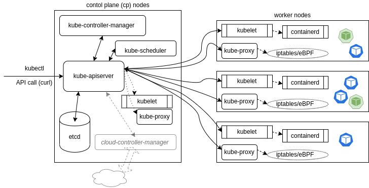

# Architecture

- [Architecture](#architecture)
  - [History](#history)
  - [Kubernetes Architecture](#kubernetes-architecture)
    - [Master Node](#master-node)
    - [Worker Node](#worker-node)
  - [Kubernetes Objects](#kubernetes-objects)
    - [Multi-tenancy](#multi-tenancy)
    - [Pod](#pod)
    - [Service](#service)
    - [Operators](#operators)
  - [Networking](#networking)
    - [Container Network Interface (CNI)](#container-network-interface-cni)
    - [Pod-to-Pod Communication](#pod-to-pod-communication)
  - [References](#references)

## History
Kubernetes is inspired by Borg - the internal system used by Google to manage its applications (e.g. Gmail, Apps, GCE). To learn more about the ideas behind Kubernetes read the "[Large-Scale Cluster Management at Google with Borg](https://research.google/pubs/pub43438/)" paper. 

Borg has inspired current data center systems, as well as the underlying technologies used in container runtime today: Google contributed `cgroups` to the Linux kernel in 2007; it limits the resources used by collection of processes. Both `cgroups` and Linux `namespaces` are at the heart of containers today, including Docker.

## Kubernetes Architecture

Kubernetes is made of one or more central managers (aka master nodes) and worker nodes. 

### Master Node
The manager runs an API server, a scheduler, various operators and a datastore to keep the state of the cluster, container settings, and the networking configuration.

The most important components of the master node are:

- `kube-apiserver`: All calls, both internal and external traffic, are handled via this agent. All actions are accepted and validated by this agent, and it is the only agent which connects to the etcd database. As a result, it acts as a master process for the entire cluster, and acts as a frontend of the cluster's shared state. Kubernetes exposes an API via the API server: you can communicate with the API using `kubectl`. Each operator interrogates the `kube-apiserver` for a particular object state, modifying the object until the declared state matches the current state.  
- The `kube-scheduler` sees the API requests for running a new container and finds a suitable node to run that container. It determines which node will host a Pod of containers: matching available resources to bind and then assigning the Pod based on availability and success. 
- `etcd Database` is a key-value store that holds the cluster state. 
- `kube-controller-manager` is a collection of controllers that are responsible for managing the state of the cluster. Each controller is a separate process, but they are all compiled into a single binary and run in a single process. The controllers are:
  - `Node Controller`: Responsible for noticing and responding when nodes go down.
  - `Replication Controller`: Responsible for maintaining the correct number of pods for every replication controller object in the system.
  - `Endpoints Controller`: Populates the Endpoints object (that is, joins Services & Pods).
  - `Service Account & Token Controllers`: Create default accounts and API access tokens for new namespaces.
- The `cloud-controller-manager` interacts with agents outside of the cloud. It handles tasks once handled by `kube-controller-manager`. 

### Worker Node
Each worker node in the cluster runs the `kubelet` and `kube-proxy` agents,  as well as the container engine, such as `containerd` or `cri-o`.
- The `kubelet` systemd service receives `PodSpecs`, downloads and manages any necessary resources and works with the underlying Docker Engine on the local node to ensure the container runs or is restarted upon failure. Should a Pod require access to storage, Secrets or ConfigMaps, the kubelet will ensure access or creation. It also sends back status to the `kube-apiserver` for eventual persistence.
- The `kube-proxy` pod creates and manages local firewall rules and networking configuration to expose containers on the network.

## Kubernetes Objects
The Kubernetes architecture is made up of many operators such as `Jobs` and `CronJobs` to handle single or recurring tasks, or custom resource definitions and purpose-built operators.
  - A `Deployment` deploys and manages a different operator called a `ReplicaSet`. 
  - A `ReplicaSet` is an operator which deploys multiple pods, each with the same spec information. These are called replicas.
  - A DaemonSet will ensure that a single pod is deployed on every node. These are often used for logging, metrics, and security pods. 
  - A StatefulSet can be used to deploy pods in a particular order, such that following pods are only deployed if previous pods report a ready status.

### Multi-tenancy
Often multiple users and teams share access to one or more clusters. This is referred to as multi-tenancy. 
- `namespace`: A segregation of resources, upon which resource quotas and permissions can be applied. Two objects cannot have the same `Name:` value in the same namespace.
- `context`: A combination of user, cluster name and namespace. This information is referenced from `~/.kube/config`.
- `Resource Limits`: A way to limit the amount of resources consumed by a pod, or to request a minimum amount of resources reserved, but not necessarily consumed, by a pod. Limits can also be set per-namespaces, which have priority over those in the `PodSpec`.
- `Pod Security Admission`: A beta feature to restrict pod behavior in an easy-to-implement and easy-to-understand manner, applied at the namespace level when a pod is created. These will leverage three profiles: `Privileged`, `Baseline`, and `Restricted policies`.
- `Network Policies`: The ability to have an inside-the-cluster firewall. These are applied at the namespace level and can be used to restrict traffic to and from pods. These are enforced by the `kube-proxy` pod on each node.

### Pod
A pod is the smallest unit of deployment in Kubernetes. It is a logical collection of one or more containers that:
- are always co-located
- share the same IP address
- share the same volumes

Pods can communicate with each other using:
- `localhost` as they share the same network namespace
- standard inter-process communications (IPC) such as SystemV semaphores or POSIX shared memory
- a shared file system such as NFS or a shared volume such as emptyDir

Containers in a Pod are started in parallel by default. As a result, there is no way to determine which container becomes available first inside a Pod. `initContainers` can be used to ensure some containers are ready before others in a pod. 

### Service
A service is a logical abstraction for a set of pods and a policy by which to access them, such as a single NodePort or a LoadBalancer to distribute inbound requests among many Pods. It is a stable endpoint to connect to a pod or a set of pods. 

### Operators
Operators are software extensions to Kubernetes that make use of custom resources to manage applications and their components. Operators follow Kubernetes principles, notably the  watch-loops and controllers. They query the current state, compare it against the spec, and execute code based on how they differ

## Networking
There are three main networking challenges to solve in Kubernetes:
- container-to-container communications (resolved by the Pod)
- pod-to-pod communications
- external-to-pod communications

Pods are assigned an IP address prior to being started. This IP address is only accessible from within the cluster. Pods can communicate with each other using this IP address.

The service object is used to connect Pods
- `ClusterIP` is used for traffic within the cluster. It is a virtual IP address that is only accessible from within the cluster.
- `NodePort` is a port that is accessible from outside the cluster. It is mapped to a ClusterIP.
- `LoadBalancer` is a service that is accessible from outside the cluster. It is mapped to a ClusterIP and a NodePort. It is typically used with a cloud provider.

[Illustrated Guide To Kubernetes Networking](https://speakerdeck.com/thockin/illustrated-guide-to-kubernetes-networking) by Tim Hockin.

### Container Network Interface (CNI)
To provide container networking, Kubernetes is standardizing on the [Container Network Interface (CNI)](https://github.com/containernetworking/cni) specification. Its aim is to provide a common interface between the various networking solutions and container runtimes. As the CNI specification is language-agnostic, there are many plugins from Amazon ECS, to SR-IOV, to Cloud Foundry, and more.
- [Introduction to CNI](https://youtu.be/YjjrQiJOyME)
- [CNI deep dive](https://youtu.be/zChkx-AB5Xc)

### Pod-to-Pod Communication
While a CNI plugin can be used to configure the network of a pod and provide a single IP per pod, CNI does not help you with pod-to-pod communication across nodes. This is where a pod network comes in. A pod network is a network overlay that allows pods to communicate with each other across nodes. It is a virtual network that is created on top of the CNI network.

Basically, all IPs involved (nodes and pods) are routable without NAT. This can be achieved at the physical network infrastructure if you have access to it (e.g. GKE). Or, this can be achieved with a software defined overlay with solutions like other pod network solutions, such as Calico, Flannel, Weave Net, and more. Each solution has its own pros and cons. For example, Calico uses BGP to route traffic between nodes, while Flannel uses VXLAN.

****
## References

- [Kubernetes Documentation](https://kubernetes.io/docs/home/)
- [Kubernetes Concepts](https://kubernetes.io/docs/concepts/)
- [Kubernetes API Reference](https://kubernetes.io/docs/reference/kubernetes-api/)
- [Borg, Omega, and Kubernetes](https://static.googleusercontent.com/media/research.google.com/en//pubs/archive/44843.pdf), Lessons learned from three container management systems over a decade.
- [Ilustrated Guide to Kubernetes Networking](https://speakerdeck.com/thockin/illustrated-guide-to-kubernetes-networking) by Tim Hockin 
